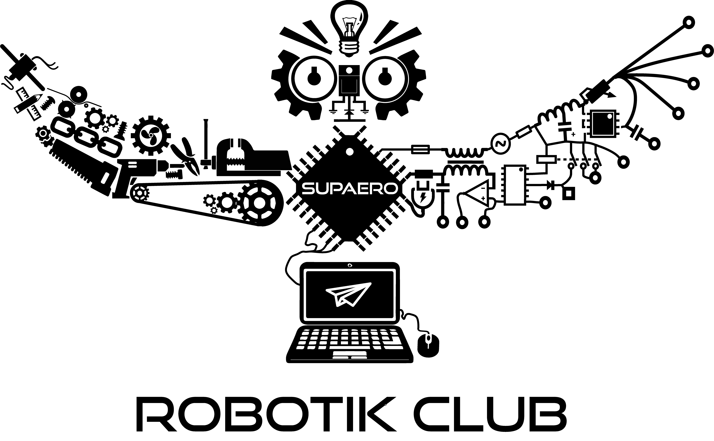

# Téléchargement du code HN

Les commandes données en exemple supposent que vous utilisez Linux avec le gestionnaire de paquets `apt`. Si ce n'est pas le cas, vous devrez les adapter.

Vous pouvez utiliser Windows ou MacOS pour programmer, mais vous aurez besoin d'un environnement Linux pour exécuter le code. Assurez-vous de mettre le code à un emplacement accessible par votre environnement Linux.

## Prérequis

- ### Git

```bash
sudo apt update
sudo apt install git
```

**Note** : Si vous installez Git sous Windows et utilisez un environnement de développement sous Windows (tel que VS Code), lisez bien les mises en garde dans les sections suivantes.

- ### Un compte GitHub

L'authentication par mot de passe en ligne de commande n'est plus prise en charge par GitHub, donc vous devez utiliser une clé SSH. Les commandes ci-dessous doivent être adaptées si vous êtes sous Windows ou MacOS.

**Créer une clé SSH**

```bash
ssh-keygen -t ed25519 
```

Voir : https://docs.github.com/fr/authentication/connecting-to-github-with-ssh/generating-a-new-ssh-key-and-adding-it-to-the-ssh-agent?platform=linux

**Ajout de la clé à GitHub**

Connectez-vous à GitHub dans votre navigateur, puis allez à : Paramètres -> Clés SSH et GPG -> Nouvelle clé SSH

Pour obtenir la clé que vous venez de créer, faites :
```
cat ~/.ssh/id_ed25519.pub
```

Voir : https://docs.github.com/fr/authentication/connecting-to-github-with-ssh/adding-a-new-ssh-key-to-your-github-account

## Clonage du code

Le code du HN est privé. Si vous n'y avez pas accès avec votre compte GitHub, contactez un membre du bureau du club ou un responsable du HN.

Choisissez le dossier où vous souhaitez mettre le code du HN sur votre ordinateur.

>**Attention** :
>- L'adresse du répertoire ne doit pas contenir d'espace, sinon vous aurez des problèmes par la suite.
>- Si vous êtes sous Windows, modifiez le paramètre `core.autocrlf` de Git :
>```
>git config --global core.autocrlf input
>```
>- Si, par la suite, vous modifiez le code sous Windows, vérifiez que les fichiers que vous modifiez sont bien en LF et non en CRLF --- ce qui est le paramètre par défaut sous Windows (sous VS Code, le paramètre est en bas à droite).

La suite du tutoriel suppose que vous mettez le code dans le dossier "Documents". 

```
cd ~/Documents
git clone -b robot_2026 --recurse-submodules git@github.com:robotik-club-supaero/isae-bots-hn-2025.git

cd isae-bots-hn-2025
```
